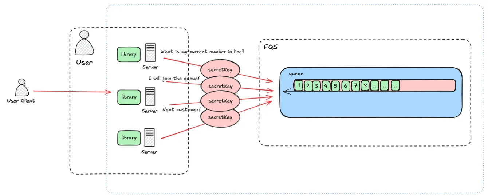
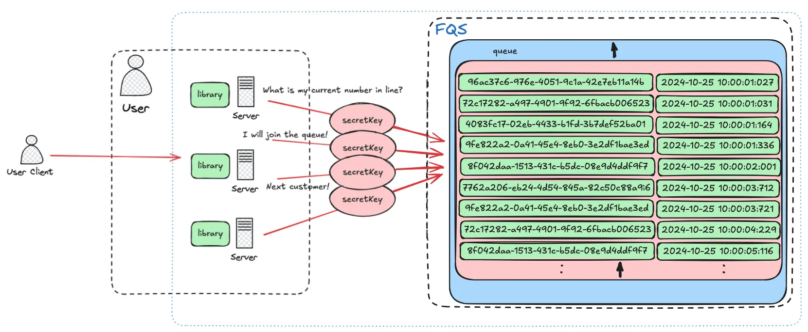

## 🐥 [FQS](https://github.com/kimgunwooo/FQS-flexible-queue-service)
- FQS is a B2B SaaS platform that provides queue functionality capable of handling large-scale traffic.
- The name *"Flexible Queue Service"* reflects its goal of offering flexible queue management to developers who utilize queue services. 
- [The Korean version](https://github.com/kimgunwooo/FQS-flexible-queue-service/tree/feat/readme/docs/README-kr.md)

## 🏃‍♂️‍➡️ OUR GOAL
- It targets developers who are building domains that experience large-scale traffic, such as ticketing.
- It offers a convenient queue service to backend developers in the form of a library.

## 👍 Merit


- It takes on the load required for queue management.
- It provides a library for easy usage.
- Using root privileges and subordinate privilege accounts allows for more detailed management.

## 🧑‍🏫 instruction

1. Sign up.
```java
POST /auth/signup
        
Request Body
{
  "groupName": "f4",
  "groupLeaderName": "Gu Jun-pyo",
  "email": "jpgoo@f4.com",
  "password": "qwe123!@#"
}

```

2. Log in to receive an authentication token.
```java
POST /auth/login/root
        
Request Body
{
  "email": "jpgoo@f4.com",
  "password": "qwe123!@#"
}

Then you can check the token contained in the Authorization field of the header.
```

3. Request to create a queue.
```java
POST /api/queue

Request Body        
{
  "name": "2024-mama-thai", // Queue name (needed for queue API calls)
  "messageRetentionPeriod": 9999, // Message retention period
  "maxMessageSize": 9999, // Maximum message size limit
  "expirationTime": "2024-11-10T12:00:00", // Queue expiration time
  "messageOrderGuaranteed": false, // Order guarantee status
  "messageDuplicationAllowed": false // Duplication allowance
}

Then you can check the secretKey in the response.
```

### Queue Service
4-0. Verify if the 'queueName' and 'secretKey' match.
```java
GET /api/queue/validate?queueName={queueName} // Enter the name used when creating the queue in {queueName}.

Request Headers 
{
  "secretKey" : {secretKey} // Add the unique secretKey issued during queue creation to the header before making the request.
}

Verify if the 'queueName' and 'secretKey' match. 
You will receive a Boolean value in response: 
true if they match, and false if they do not match.

Response Body
{
   "success": "true",
   "data": {
       "userId": "f728287c-2d0b-4fd0-9196-5669269804c3"
   }
}
```

4-1. Create a ticket in the queue.
```java
POST /{queueName}/api/queue // Enter the name used when creating the queue in {queueName}.

Request Headers 
{
  "secretKey" : {secretKey} // Add the unique secretKey issued during queue creation to the header before making the request.
}

Then you can check the unique string of the ticket in the response.

Response Body
{
   "success": "true",
   "data": {
       "userId": "f728287c-2d0b-4fd0-9196-5669269804c3"
   }
}
```


4-2. Consume from the queue.
```java
POST /{queueName}/api/queue/consume?size={size} // Enter the name used when creating the queue in {queueName}. Enter the number of tickets to consume in {size}.

Request Headers
{
  "secretKey" : {secretKey} // Add the unique secretKey issued during queue creation to the header before making the request.
}

Then you will receive the unique IDs of the tickets to be processed.

Response Body
{
    "success": "true",
    "data": {
        "consumes": [
            "f210f629-db49-493b-9634-67793615e3bb"
        ]
    }
}
```

4-3. Check my current rank.
```java
Get /{queueName}/api/queue/ranks?identifier={numberID} // Enter the name used when creating the queue in {queueName}. Enter the unique ID of the ticket to check the rank in {numberID}.

Request Headers 
{
  "secretKey" : {secretKey} // Add the unique secretKey issued during queue creation to the header before making the request.
}

Then you can find out the current rank of the ticket.
        
Response Body
{
    "success": "true",
    "data": {
        "rank": 7
    }
}
```


